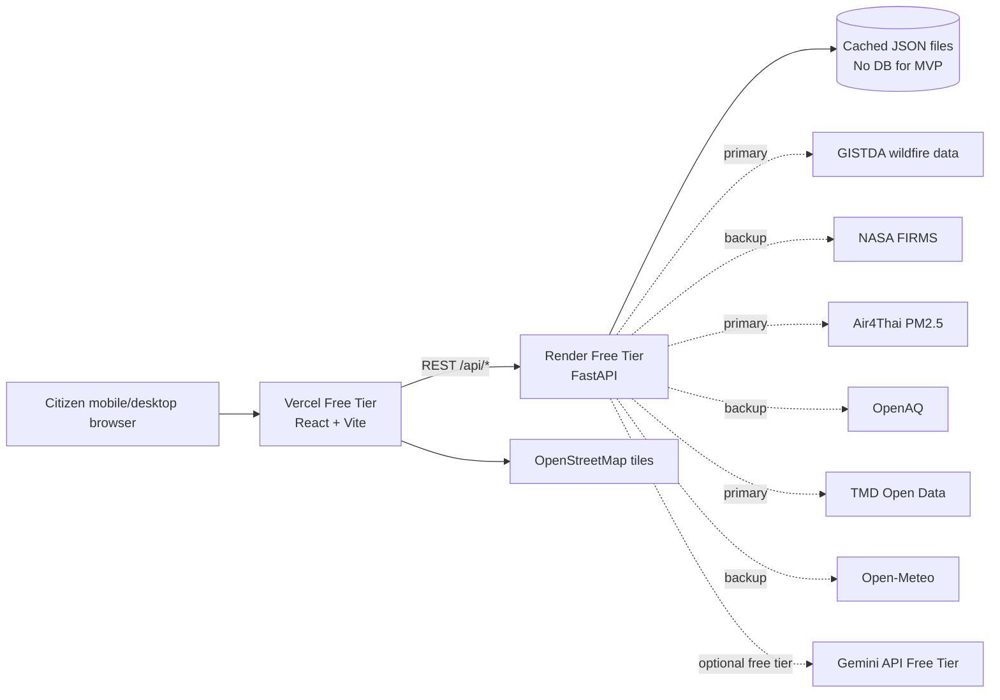

# ChiangMaiEyes Architecture

## System Architecture Diagram



## Runtime Flow

1. Frontend requests `GET /api/dashboard`.
2. FastAPI reads cached JSON files from `backend/data`.
3. Backend calculates transparent risk score from PM2.5, hotspot count, and wind direction.
4. Backend returns unified dashboard payload.
5. React renders Leaflet map, PM2.5 panel, hotspot panel, wind layer, risk score, and Thai summary.

## Folder Structure

```text
ChiangMaiEyes/
  backend/
    app/
      main.py
      config.py
      models.py
      services.py
    data/
      hotspots.json
      pm25.json
      weather.json
    tests/
      test_risk.py
    requirements.txt
    render.yaml
  frontend/
    src/
      components/
        DashboardMap.tsx
      lib/
        api.ts
        risk.ts
        types.ts
      styles/
        global.css
      App.tsx
      main.tsx
    package.json
    vite.config.ts
  docs/
    ARCHITECTURE.md
    API.md
    ROADMAP.md
    DEPLOYMENT.md
    FALLBACKS.md
```

## Database Design

No database is used in the MVP. The backend uses cached JSON files:

- `hotspots.json`: latest hotspot collection and aggregate count.
- `pm25.json`: PM2.5 station readings, average value, category, and trend.
- `weather.json`: wind, temperature, humidity, and latest update.

If the project later needs history, add PostgreSQL with tables for `hotspot_observations`, `pm25_readings`, `weather_readings`, and `daily_summaries`.
