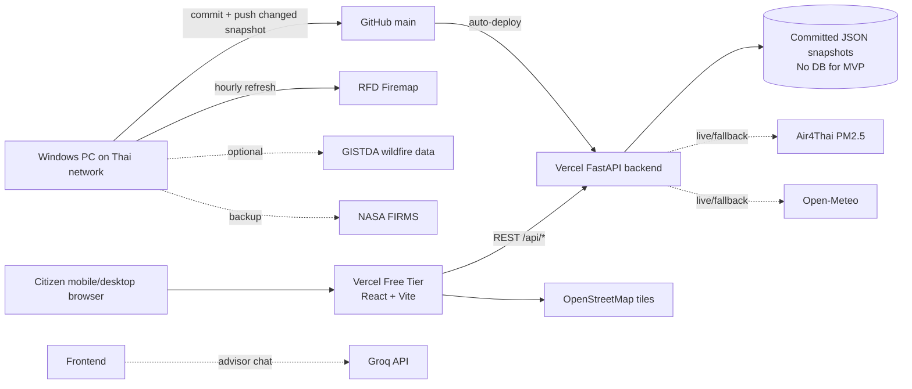

# ChiangMaiEyes Architecture

## System Architecture Diagram



## Runtime Flow

1. The local Thai-network refresh worker updates `backend/data/*.json` and `frontend/src/data/dashboardSnapshot.json` when the reconciled hotspot set changes.
2. The worker commits and pushes changed snapshots to `main`.
3. Vercel deploys the `frontend` and `backend` projects from the pushed commit.
4. Frontend requests `GET /api/dashboard` and `GET /api/data-status`.
5. FastAPI serves the latest committed snapshot, calculates the risk score, and reports snapshot freshness.
6. React renders Leaflet map, PM2.5 panel, hotspot panel, wind layer, risk score, data-status strip, and Thai summary.

## Folder Structure

```text
ChiangMaiEyes/
  backend/
    app/
      main.py
      config.py
      models.py
      services.py
    data/
      hotspots.json
      pm25.json
      weather.json
    tests/
      test_risk.py
    requirements.txt
    pyproject.toml
    vercel.json
  frontend/
    src/
      components/
        DashboardMap.tsx
      lib/
        api.ts
        risk.ts
        types.ts
      styles/
        global.css
      App.tsx
      main.tsx
    package.json
    vite.config.ts
  docs/
    ARCHITECTURE.md
    API.md
    ROADMAP.md
    DEPLOYMENT.md
    FALLBACKS.md
```

## Database Design

No database is used in the MVP. The backend uses cached JSON files:

- `hotspots.json`: latest hotspot collection and aggregate count.
- `pm25.json`: PM2.5 station readings, average value, category, and trend.
- `weather.json`: wind, temperature, humidity, and latest update.

If the project later needs history, add PostgreSQL with tables for `hotspot_observations`, `pm25_readings`, `weather_readings`, and `daily_summaries`.

## Production Data Mode

Production currently runs in `local-refresh-snapshot` mode. Vercel does not
fetch RFD directly because RFD blocks non-Thai infrastructure. The endpoint
`GET /api/data-status` exposes this mode, the latest timestamp, snapshot age,
hotspot count, and source breakdown so operators can see what production is
actually serving.
