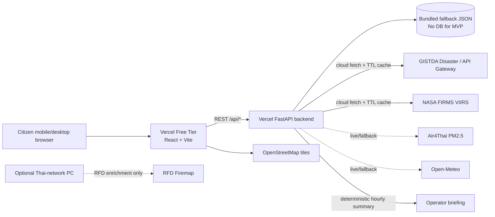

# ChiangMaiEyes Architecture

## System Architecture Diagram


```mermaid
flowchart LR
  Citizen[Citizen mobile/desktop browser] --> Vercel[Vercel Free Tier\nReact + Vite]
  Vercel -->|REST /api/*| Backend[Vercel FastAPI backend]
  Backend --> Cache[(Bundled fallback JSON\nNo DB for MVP)]
  Backend -->|cloud fetch + TTL cache| GISTDA[GISTDA Disaster / API Gateway]
  Backend -->|cloud fetch + TTL cache| FIRMS[NASA FIRMS VIIRS]
  ThaiPC[Optional Thai-network PC] -. RFD enrichment only .-> RFD[RFD Firemap]
  Backend -. live/fallback .-> Air4Thai[Air4Thai PM2.5]
  Backend -. live/fallback .-> OpenMeteo[Open-Meteo]
  Backend -->|deterministic hourly summary| Summary[Operator briefing]
  Vercel --> OSM[OpenStreetMap tiles]
```

## Runtime Flow

1. Frontend requests `GET /api/dashboard` and `GET /api/data-status`.
2. FastAPI fetches cloud-friendly hotspot sources (GISTDA and NASA FIRMS when configured), clips points to Chiang Mai, reconciles duplicate detections, and caches briefly.
3. If all cloud hotspot providers fail, FastAPI falls back to bundled JSON snapshots.
4. FastAPI generates a deterministic hourly operator briefing from PM2.5, hotspots, wind, risk, and source provenance. No Gen AI call is used for this summary.
5. React renders Leaflet map, PM2.5 panel, hotspot panel, wind layer, risk score, data-status strip, and Thai summary.
6. The Thai-network worker is optional legacy/enrichment mode only when `HOTSPOT_INCLUDE_RFD=true`.

## Folder Structure

```text
ChiangMaiEyes/
  backend/
    app/
      main.py
      config.py
      models.py
      services.py
    data/
      hotspots.json
      pm25.json
      weather.json
    tests/
      test_risk.py
    requirements.txt
    pyproject.toml
    vercel.json
  frontend/
    src/
      components/
        DashboardMap.tsx
      lib/
        api.ts
        risk.ts
        types.ts
      styles/
        global.css
      App.tsx
      main.tsx
    package.json
    vite.config.ts
  docs/
    ARCHITECTURE.md
    API.md
    ROADMAP.md
    DEPLOYMENT.md
    FALLBACKS.md
```

## Database Design

No database is used in the MVP. The backend uses cached JSON files:

- `hotspots.json`: latest hotspot collection and aggregate count.
- `pm25.json`: PM2.5 station readings, average value, category, and trend.
- `weather.json`: wind, temperature, humidity, and latest update.

If the project later needs history, add PostgreSQL with tables for `hotspot_observations`, `pm25_readings`, `weather_readings`, and `daily_summaries`.

## Production Data Mode

Production currently runs in `live-backend` mode for hotspots. Vercel fetches
NASA/GISTDA satellite feeds directly and reports the active source breakdown via
`GET /api/data-status`. RFD Firemap is disabled by default; enable
`HOTSPOT_INCLUDE_RFD=true` only for an environment with reliable Thai egress.
